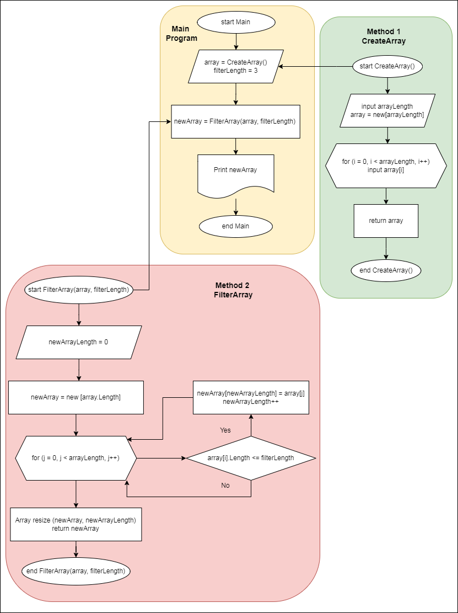
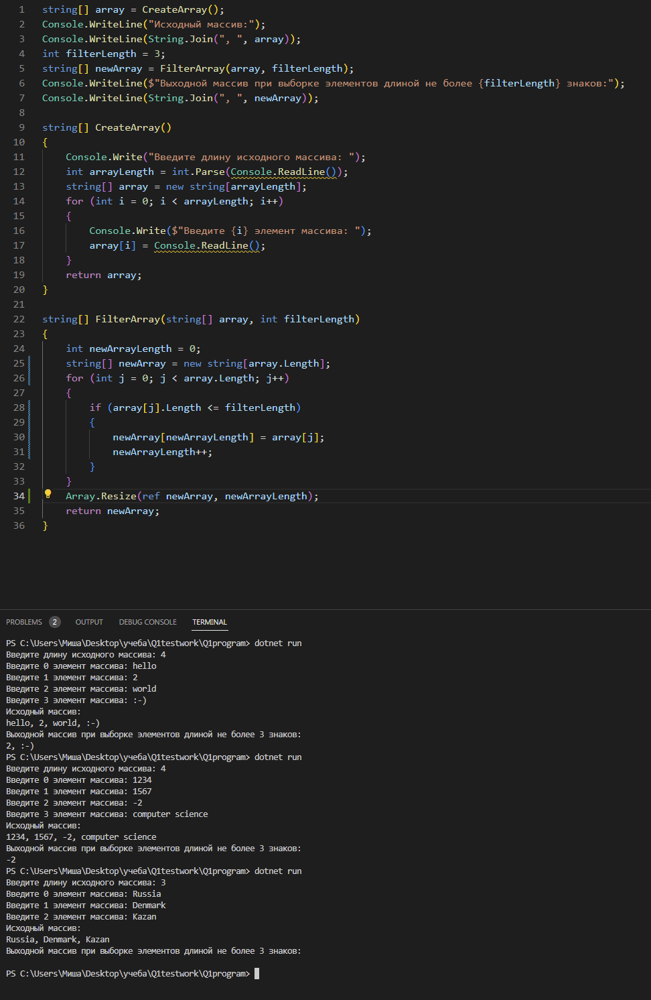

# **Задача:** 
Написать программу, которая из имеющегося массива строк формирует массив из строк, длина которых меньше либо равна 3 символа. Первоначальный массив можно ввести с клавиатуры, либ задать на старте выполнения алгоритма. При решении не рекомендуется пльзоваться коллекциями, лучше обойтись исключительно массивами.

# **Решение:**

## 1. Напишем метод, позволяющий нам создать массив типа string[] заданной длины и заполнить его с клавиатуры.

+ Метод с типом string[] без параметров, где мы вначале предлагаем пользователю ввести длину создаваемого массива (тут по идее нужно запрещать или обрабатывать ввод всего, кроме натуральных чисел, иначе программа будет падать). 
+ Далее определившись с длиной массива создаем его и предлагаем пользователю ввести текстовые элементы через цикл заданное длиной массива количество раз.
+ Возвращаем готовый исходный массив.

## 2. Напишем метод, берущий исходный массив и преобразующий его в выходной массив того же типа в соответствии с требуемыми условиями задачи.

 * Метод с типом string[] и двумя параметрами в виде массива с типом string[] и переменной 'длина строкового элемента' с типом int, где мы фильтруем строковые элементы по их длине не более второго параметра (в нашем случае 3). 
 * Поскольку мы заранее не знаем длину выходного массива, сначала придется посчитать с помощью цикла количество удовлетворяющих условию элементов в исходном массиве. 
 * Затем создать выходной массив требуемой длины. 
 * Далее с помощью цикла с двумя счетчиками записать в него элементы исходного массива, удовлетворяющие условию задачи. 
 * Вернуть выходной массив. 

## 3. Вызовем методы 1 и 2 в основной программе.

- Вызовем метод 1 при задании исходного массива типа string[].
- Распечатаем исходный массив для наглядности.
- Зададим переменную 'длина строкового элемента' типа int (в нашем случае длина равна 3).
- Вызовем метод 2 с двумя параметрами в виде исходного массива и длины строкового элемента для фильтрации.
- Распечатаем выходной массив с элементами длиной меньше 3 в виде результата.

# **Блок-схема:**

# **Код программы с примером работы:**

